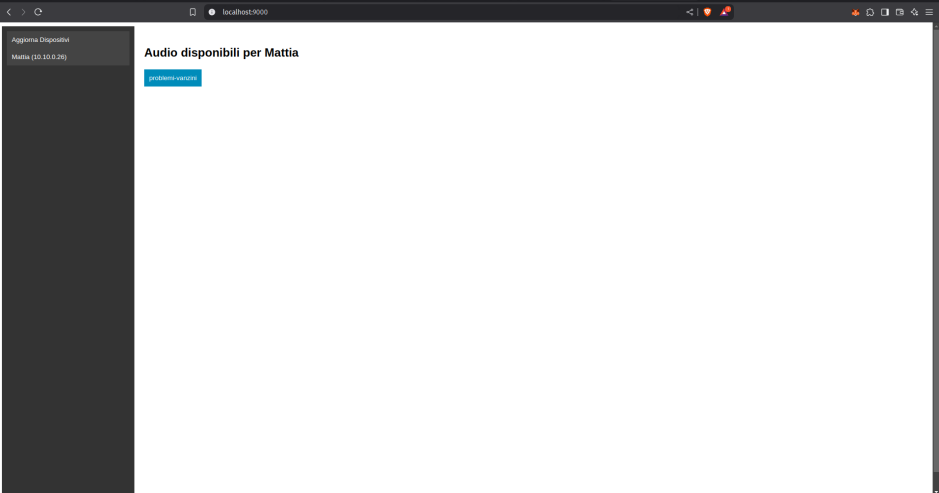

# WaahCavlo-F1-alarms
Have the selected audio message based on the comments of the Italian f1 commentators Carlo Vanzini, Matteo Bobbi Roberto Chinchero & Marc Genè play on the selected device on the lan (which is running this app) 

# Install
This app needs to be runned with python 3.9 based on your os create a virtualenv with this python version and install dependencies with `pip3 install -r requirements.txt`

create an `.env` like below:
```sh
VISIBLE_NAME=MarieCMDM
SUBNET=192.168.1.0/24
```
Put in `VISIBLE_NAME` the name that will be used to identify your devie in the lan and in `SUBNET` the subnet address/mask of your lan

# Run
Run the app with `pyhon3 run.py`

# Web-ui
a Simple web ui is served on `http://localhost:9000/` to play audios on the target device


